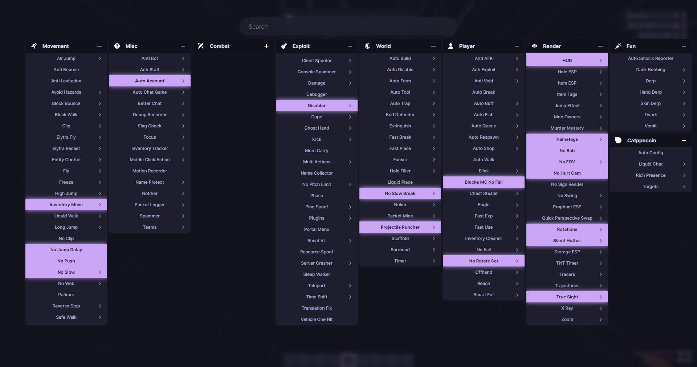

<h3 align="center">
	 
	
	Catppuccin for <a href="https://liquidbounce.net/">LiquidBounce</a>
	
</h3>

    
    
    

  
Gallery

  
  ## HUD
  
  ## ClickGUI (with Pomofocus integration)
  
  ## Main Menu
  
  ## Alt Manager (Modal)
  

## Usage

1. Download your preferred flavour

Navigate to the releases section and grab whichever flavour or accent you want. Or, if you can't be bothered to find it, there is a convenient link [here](https://github.com/liquidsquid1/catppuccin-lb/releases/tag/latest)

2. Move it into your client folder
Navigate to catppuccin-lb/dist and place the dist folder in your themes folder
> [!NOTE]
> Don't know how to get to your themes folder? Simply type `.client theme browse` in your minecraft chat and it will open up the directory.

3. Set your theme
> [!WARNING]
> This will override your current hud layout, including your positions of elements.

Simply type `.client theme set catppuccin` in your minecraft chat.
